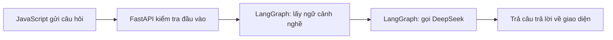

# La Bàn · Trang chủ hướng nghiệp KHKT 2027

Trang chủ tiếng Việt dành cho học sinh THCS/THPT, dùng Python FastAPI, HTML, Bootstrap 5.3.8, CSS, JavaScript. AI dùng DeepSeek API và LangGraph.

## Chức năng đã có

- Giới thiệu dự án, đội thực hiện và mục tiêu hướng nghiệp trực quan.
- Sáu nghề mẫu; tìm kiếm không phân biệt dấu tiếng Việt, lọc lĩnh vực, xem hoạt động hàng ngày và kỹ năng trong hộp thoại.
- Ba bài viết với nội dung đầy đủ, đọc ngay trên trang.
- Trợ lý khám phá nghề: LangGraph lấy ngữ cảnh nghề rồi gọi DeepSeek ở server.
- Responsive, menu điện thoại, điều hướng bàn phím, giảm chuyển động theo cài đặt thiết bị, trạng thái tải/lỗi và thử lại.
- Firebase Authentication: đăng ký/đăng nhập email, Google, quên mật khẩu, xác minh email, xem tài khoản và đăng xuất; cần cấu hình project để sử dụng thật.

Hiện gồm trang chủ và mã đăng nhập Firebase; chưa có lưu nghề yêu thích, lịch sử trắc nghiệm, quản trị hoặc phim hoạt hình nghề nghiệp. Nghề nổi bật là nội dung bản mẫu, không phải xếp hạng thị trường. Tên La Bàn là tên giao diện đề xuất.

## Thiết lập đăng nhập Firebase

Đọc [hướng dẫn Firebase từng bước](docs/firebase-setup.md). Đăng ký ứng dụng Web trong Firebase, bật Email/Password và Google, thêm domain chạy thử, rồi điền các biến `FIREBASE_*` vào `.env` hoặc Vercel. Mã đăng nhập không cần service account/private key. Khi chưa cấu hình, hộp đăng nhập thông báo đang được thiết lập và trang chủ vẫn hoạt động.

## Chạy trên Windows PowerShell

```powershell
python -m venv .venv
.\.venv\Scripts\python.exe -m pip install -r requirements.txt
Copy-Item .env.example .env
# Điền DEEPSEEK_API_KEY vào .env trên máy của bạn.
.\.venv\Scripts\python.exe -m uvicorn app:app --reload
```

Mở http://127.0.0.1:8000. Trang chủ hoạt động khi chưa có API key; trợ lý sẽ báo đang được chuẩn bị. Không đưa key vào JavaScript, GitHub hoặc tài liệu.

```powershell
.\.venv\Scripts\python.exe -m unittest discover -s tests -v
```

## GitHub và Vercel

Repository đích do người dùng cung cấp: https://github.com/TrooliGM/quocan4.

1. Đăng nhập Vercel và chọn **Add New → Project**, import repository trên.
2. Chọn framework **FastAPI**, root directory là thư mục gốc repository; không cần lệnh build frontend.
3. Trong Environment Variables, đặt `DEEPSEEK_API_KEY` và `DEEPSEEK_MODEL=deepseek-chat`.
4. Deploy. Kiểm tra `/`, `/api/health`, tìm kiếm và trợ lý. Nếu thêm key sau khi deploy, redeploy.

`app.py` xuất `app`, `vercel.json` chọn FastAPI. `public/assets` được CDN phục vụ trên Vercel; local dùng StaticFiles. Dependencies nằm trong `requirements.txt`. Dữ liệu mẫu ở `content.py`; bản này không ghi vào ổ đĩa của serverless.

## Luồng AI



AI không lưu lịch sử hội thoại và mỗi câu hỏi được gửi độc lập. Endpoint giới hạn độ dài, timeout và số lời gọi đồng thời trong mỗi instance. Trước khi mở rộng truy cập công khai, đặt giới hạn chi tiêu API và rate limit ở Vercel Firewall hoặc kho dùng chung; semaphore không phải rate limit giữa nhiều serverless instance.

## Tài liệu kỹ thuật đã đối chiếu

- [FastAPI trên Vercel](https://vercel.com/docs/frameworks/backend/fastapi)
- [LangGraph](https://docs.langchain.com/oss/python/langgraph/overview)
- [Bootstrap](https://getbootstrap.com/docs/5.3/getting-started/introduction/)
- [DeepSeek API](https://api-docs.deepseek.com/)

## Trạng thái xác minh

Xem `docs/validation.md` để biết kiểm tra đã chạy và những phần còn cần tài khoản/cấu hình.
